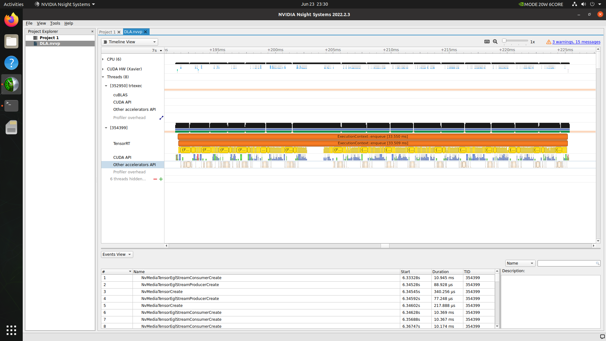

# LeViT-TensorRT
The goal of this project is to accelerate the deployment of __LeViT__ networks using __TensorRT__, including test results for FP16 and Int8.

## Overview
As the current visual Transformer with the fastest inference speed, LeViT is significantly better than existing CNNs and visual Transformers in terms of speed/accuracy trade-offs, such as ViT, DeiT, etc., and the top-1 accuracy rate reaches 80%. On CPU, Lower LeViT 3.3x faster than EfficientNet, 2x faster on gpu and nearly 10x faster on arm. It has high application value in scenarios with limited computing power. \
In this repo, focus on using TensorRT to accelerate deployment on the __NVIDIA Jetson__ platform, with __DLA__ accelerated test results.

## Setup 
LeViT original repo：[_LeViT_](https://github.com/facebookresearch/LeViT) \
1.Data preparation
```
/path/to/imagenet/
  train/
    class1/
      img1.jpeg
    class2/
      img2.jpeg
  val/
    class1/
      img3.jpeg
    class/2
      img4.jpeg
```
2.Environments \
  a). Jetson \
Jetpack SDK 5.0.1


  b).X86
```bash
$ nvidia-docker pull registry.cn-hangzhou.aliyuncs.com/trt2022/dev
```
  c).common
```bash
$ git clone https://github.com/JQZhai/LeViT-TensorRT.git
```
```bash
$ cd LeViT-TensorRT
```
```bash
$ pip install -r requirment.txt
```
```bash
$ python -m pip install colored polygraphy --extra-index-url https://pypi.ngc.nvidia.com
```
```bash
$ python3 -m pip install onnx_graphsurgeon --index-url https://pypi.ngc.nvidia.com
```
```bash
$ pip install pytorch-quantization --extra-index-url https://pypi.ngc.nvidia.com
```
3.Model Zoo \
[_LeViT-128S_](https://dl.fbaipublicfiles.com/LeViT/LeViT-128S-96703c44.pth)
[_LeViT-128_](https://dl.fbaipublicfiles.com/LeViT/LeViT-128-b88c2750.pth)
[_LeViT-192_](https://dl.fbaipublicfiles.com/LeViT/LeViT-192-92712e41.pth)
[_LeViT-256_](https://dl.fbaipublicfiles.com/LeViT/LeViT-256-13b5763e.pth)
[_LeViT-384_](https://dl.fbaipublicfiles.com/LeViT/LeViT-384-9bdaf2e2.pth) 

## Export to ONNX and Build TensorRT Engine
1.Download the __Levit__ pretrained model from Model Zoo.Evaluate the accuracy of the Pytorch pretrained model.
```bash
$ python main.py --eval --model LeViT_128S --data-path /path/to/imagenet
```
2.`export.py` exports a pytorch model to onnx format.
```bash
$ python export.py --model <model name> --finetune path/to/pth_file
```
3.Build the TensorRT engine using `trtexec`.  
```bash
$ trtexec --onnx=path/to/onnx_file --buildOnly  --saveEngine=path/to/engine_file --workspace=4096
```  
For fp16 mode, fp16 cannot store very large and very small numbers like fp32. So we let some nodes fall back to fp32 mode to ensure the correctness of the final output.Keep the same input as the onnx format model, and __use the output in onnx fp32 mode as the standard to calculate the error__.
```bash
polygraphy run ../LeViT-128S.onnx \
--onnxrt -v --workspace=28G --fp16 \
--input-shapes 'input_0:[1,3,224,224]' --onnx-outputs mark all \
--save-inputs onnx_input.json --save-outputs onnx_res.json
```
```bash
$ polygraphy debug precision ../LeViT-128S.onnx \
-v --fp16 --workspace 28G --no-remove-intermediate --log-file ./log_file.json \
--trt-min-shapes 'input_0:[1,3,224,224]' \
--trt-opt-shapes 'input_0:[1,3,224,224]' \
--trt-max-shapes 'input_0:[1,3,224,224]' \
-p fp32 --mode bisect --dir forward --show-output \
--artifacts ./polygraphy_debug.engine --art-dir ./art-dir \
--check \
polygraphy run polygraphy_debug.engine \
--trt --load-outputs onnx_res.json --load-inputs onnx_input.json \
--abs 1e-2 -v --rel 1e-2
```  
For int8 mode,Tried both PTQ and QAT strategies. \
__PTQ__
```bash
$ polygraphy debug precision ../LeViT-128S.onnx \
-v --int8 --workspace 28G --no-remove-intermediate --log-file ./log_file.json \
--trt-min-shapes 'input_0:[1,3,224,224]' \
--trt-opt-shapes 'input_0:[1,3,224,224]' \
--trt-max-shapes 'input_0:[1,3,224,224]' \
-p fp16 --mode bisect --dir forward --show-output --calibration-cache ./cal_trt.bin \
--artifacts ./polygraphy_debug.engine --art-dir ./art-dir \
--check \
polygraphy run polygraphy_debug.engine \
--trt --load-outputs ../fp16/onnx_res.json --load-inputs ../fp16/onnx_input.json \
--abs 1e-2 -v --rel 1e-2
``` 
__QAT__ \
```$ python AutoQAT.py```
```$ python QATexport.py```

 You can use the `trtexec` to test the throughput of the TensorRT engine.
 ```bash
 $ trtexec --loadEngine=/path/to/engine——file
 ``` 
 
4.`trt/eval_onnxrt.py` aims to evalute the accuracy of the Onnx model.
```bash
$ python trt/eval_onnxrt.py --eval --resume path/to/onnx_file --data-path ../imagenet_1k --batch-size 32
```  

## Original Model Accuracy Test (V100, TensorRT 8.2.3) ##
  
| LeVit(V100) | Acc@1 | Notes |
| :---: | :---: | :---: |
| PyTorch Pretrained Model |  76.6 |  |
| Onnx Model | 94.4 | Only Classes(0-9) |

## Speed Test of TensorRT engine (Xavier NX, TensorRT 8.4.0) ##
  
| LeVit(V100) | FP32 | FP16 | INT8, QAT | INT8 PTQ | FP16 with DLA |
| :---: | :---: | :---: | :---: | :---: | :---: |
| batchsize=1 | 242.334 qps | 287.315 qps | 294.565 qps | 235.711 qps | 81.6333 qps |

## Result:
1.Under the condition of guaranteed accuracy, compared with fp32 mode, fp16 mode is 18.56% faster, and int8 QAT is 21.55% faster.\
2.In order to ensure the accuracy of the output, in the fp16 mode, some nodes return to the fp32 mode for calculation, which will introduce some data format conversion overhead, resulting in a performance improvement of less than two times.
3.The performance improvement of the int8 QAT mode is much greater than that of the jetson platform on the dGPU condition, which may be related to the hardware.
4.Regarding the jetson-specific DLA hardware acceleration, the final result is a negative optimization. The main reason is that LeVit is a transformer model, which actually contains only a few convolution operations. In addition, there are many operations in the network that cannot be parsed by DLA, which causes the entire network to be cut into many sub-networks, which exceeds the maximum number of sub-networks supported by DLA. The data being passed back and forth between the DLA and the GPU is the main reason for the huge drop in inference speed.

